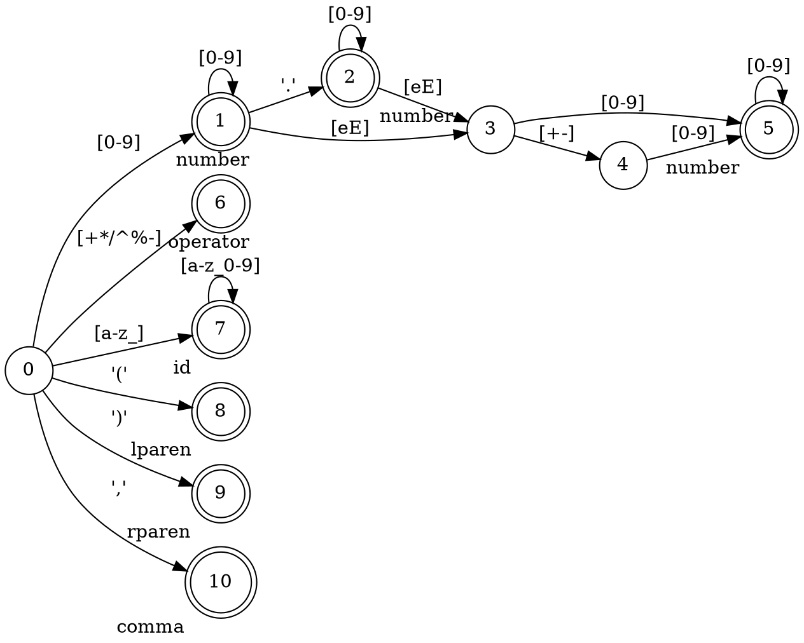

```
<токен> ::= <шаблон>
number ::= /[0-9]+(\.[0-9]*)?([eE][+-]?[0-9]+)?/
operator ::= /[+*/^%-]/
id ::= /[a-z_][a-z_0-9]*/
lparen ::= /\(/
rparen ::= /\)/
comma ::= /,/
```




| состояние | символ   | новое состояние |
|-----------|----------|-----------------|
| 0         | [a-z_]   | 7               |
| 0         | (        | 8               |
| 0         | )        | 9               |
| 0         | ,        | 10              |
| 0         | [+*/^%-] | 6               |
| 0         | [0-9]    | 1               |
| 1         | [0-9]    | 1               |
| 1         | \.       | 2               |
| 1         | [eE]     | 3               |
| 2         | [0-9]    | 2               |
| 2         | [eE]     | 3               |
| 3         | [+-]     | 4               |
| 3         | [0-9]    | 5               |
| 4         | [0-9]    | 5               |
| 5         | [0-9]    | 5               |
| 7         | [a-z_0-9]| 7               |

| состояние | токен    |
|-----------|----------|
| 1         | number   |
| 2         | number   |
| 5         | number   |
| 6         | operator |
| 7         | id       |
| 8         | lparen   |
| 9         | rparen   |
| 10        | comma    |
